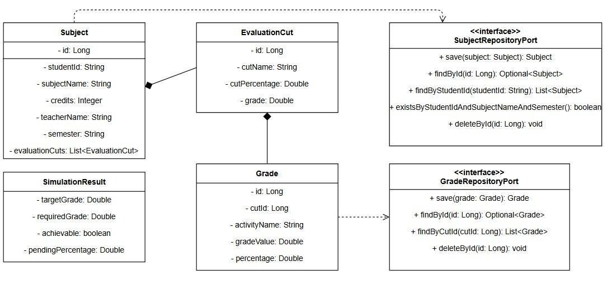
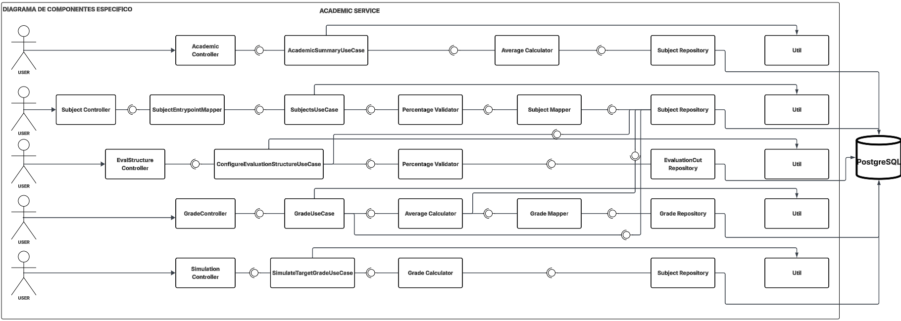
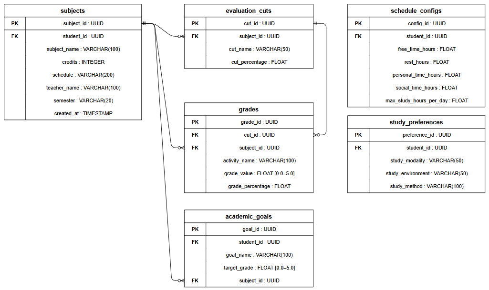

<div align="center">

# 📚 dark-code-knights-academic-service

### *Módulo 2 — Gestión Académica — A.IBERT ECI Planner*

> Registra materias, cortes de evaluación y notas del estudiante,
> calcula promedios automáticamente y proyecta qué nota necesita
> para alcanzar su meta académica.

---

### 🛠️ Stack Tecnológico


### ☁️ Infraestructura & Calidad


### 🏗️ Arquitectura


</div>

---

## 📑 Tabla de Contenidos

1. [👤 Integrantes](#1--integrantes)
2. [🎯 Descripción del Módulo](#2--descripción-del-módulo)
3. [⚙️ Tecnologías Utilizadas](#3--tecnologías-utilizadas)
4. [🏗️ Cómo Funciona el Módulo](#4--cómo-funciona-el-módulo)
   - [4.1 Módulos con los que se comunica](#41-módulos-con-los-que-se-comunica)
   - [4.2 Patrones utilizados](#42-patrones-utilizados)
   - [4.3 Estilo de arquitectura detallado](#43-estilo-de-arquitectura-detallado)
   - [4.4 Reglas de negocio críticas](#44-reglas-de-negocio-críticas)
5. [📊 Diagramas](#5--diagramas)
   - [5.1 Diagrama de Contexto](#51-diagrama-de-contexto)
   - [5.2 Diagrama de Clases](#52-diagrama-de-clases)
   - [5.3 Diagrama de Componentes](#53-diagrama-de-componentes)
   - [5.4 Diagrama Entidad-Relación](#54-diagrama-entidad-relación)
6. [⚡ Funcionalidades](#6--funcionalidades)
   - [6.1 R05 — Dashboard Académico](#61-r05--dashboard-académico)
   - [6.2 R06 — Gestión de Materias](#62-r06--gestión-de-materias)
   - [6.3 R07 — Estructura de Evaluación](#63-r07--estructura-de-evaluación)
   - [6.4 R08 — Registro de Notas](#64-r08--registro-de-notas)
   - [6.5 R09 — Edición de Notas y Promedios](#65-r09--edición-de-notas-y-promedios)
   - [6.6 R10 — Simulación de Nota Objetivo](#66-r10--simulación-de-nota-objetivo)
7. [🔌 Conexiones con Servicios Externos](#7--conexiones-con-servicios-externos)
8. [⚠️ Manejo de Errores](#8--manejo-de-errores)
9. [📋 Estrategia de Versionamiento y Branches](#9--estrategia-de-versionamiento-y-branches)
   - [9.1 Convenciones para crear ramas](#91-convenciones-para-crear-ramas)
   - [9.2 Convenciones para crear commits](#92-convenciones-para-crear-commits)
10. [🧪 Evidencia de Pruebas Unitarias](#10--evidencia-de-pruebas-unitarias)
11. [📈 Evidencia de Análisis de Cobertura](#11--evidencia-de-análisis-de-cobertura)
12. [🗂️ Código Organizado por Carpetas](#12--código-organizado-por-carpetas)
13. [🚀 Cómo Ejecutar el Proyecto](#13--cómo-ejecutar-el-proyecto)
14. [☁️ CI/CD y Despliegue en Azure](#14--cicd-y-despliegue-en-azure)
    - [14.1 Jobs del Pipeline](#141-jobs-del-pipeline)
    - [14.2 Evidencia del Despliegue](#142-evidencia-del-despliegue)
    - [14.3 Link Swagger en Azure](#143-link-swagger-en-azure)
15. [🔐 Variables de Entorno](#15--variables-de-entorno)
16. [📚 Referencias](#16--referencias)

---

## 1. 👤 Integrantes

**Módulo 2 — Gestión Académica**  
**Proyecto:** A.IBERT — ECI Planner  
**Institución:** Escuela Colombiana de Ingeniería Julio Garavito

<div align="center">

| 👨‍💻 Integrante | 🎓 Rol | 📋 Responsabilidades |
|---|---|---|
| Jose Luis Lancheros | Backend Developer | Creación y configuración del repositorio, estructura base, CI/CD, implementación de requerimientos, dockerización y despliegue en Azure |
| Natalia Mahecha | Líder | Requerimientos funcionales, matriz de trazabilidad, documentos del sprint, gestión del backlog en Jira |
| Andres Camilo Vivas | Backend Arquitectura | Diagramas, pruebas unitarias, análisis de cobertura con JaCoCo y SonarCloud |
| Carlos Uribe | Frontend Developer | Implementación de pantallas en Figma |

</div>

---

## 2. 🎯 Descripción del Módulo

El **Módulo 2 — Gestión Académica** es el núcleo de seguimiento de rendimiento estudiantil del sistema A.IBERT — ECI Planner.

No se limita a almacenar notas, sino que calcula promedios automáticamente, detecta la situación académica real del estudiante y proyecta qué necesita en evaluaciones futuras para alcanzar su meta.

<div align="center">

| ✅ **Qué hace** | ❌ **Problema que resuelve** |
|:---|:---|
| Centraliza el registro de materias, cortes y notas | Información académica dispersa en cuadernos y hojas de cálculo |
| Recalcula promedios automáticamente ante cada cambio | Cálculos manuales propensos a errores |
| Bloquea la estructura cuando hay notas registradas | Inconsistencias al modificar cortes retroactivamente |
| Genera un dashboard con todas las materias del semestre | Falta de visión global del rendimiento académico |
| Simula la nota mínima necesaria para alcanzar la meta | Incertidumbre sobre si aún es posible pasar una materia |

</div>

### Microservicios del Módulo 2

| Microservicio | Puerto | Responsabilidad |
|---|---|---|
| academic-service | 8080 (local) / 8083 (Docker) | Gestión académica completa |

---

## 3. ⚙️ Tecnologías Utilizadas

<div align="center">

| **Tecnología / Herramienta** | **Uso principal en el proyecto** |
|---|---|
| **Java 21** | Lenguaje de programación base del microservicio backend. |
| **Spring Boot 3.4.3** | Framework principal para construir el microservicio, exponiendo APIs REST. |
| **Spring Web** | Exposición de endpoints REST dentro de la arquitectura hexagonal. |
| **Spring Security + jjwt 0.11.5** | Configurado en `permitAll` hasta Fase 7; listo para JWT de auth-service. |
| **Spring Data JPA** | Integración con la base de datos relacional usando el patrón Repository. |
| **PostgreSQL 16** | Base de datos relacional para persistir materias, cortes y notas. |
| **Apache Maven** | Gestión de dependencias, empaquetado y automatización de builds en CI/CD. |
| **MapStruct 1.5.5.Final** | Mapeo automático entre capas sin código manual. |
| **Lombok 1.18.32** | Reducción de código repetitivo con `@Builder`, `@Getter`, `@Data`. |
| **SpringDoc OpenAPI 2.8.5** | Swagger UI automático en `/swagger-ui.html`. |
| **Spring Boot Validation** | Bean Validation con `@Valid`, `@NotNull`, `@Size`, etc. |
| **JUnit 5** | Framework de pruebas unitarias para validar casos de uso y dominio. |
| **Mockito** | Simulación de dependencias (puertos, repositorios) en pruebas unitarias. |
| **H2** | Base de datos en memoria para el perfil de pruebas en CI. |
| **Testcontainers** | Tests de integración con contenedores reales. |
| **JaCoCo 0.8.12** | Generación de reportes de cobertura (mínimo 80% INSTRUCTION). |
| **SonarCloud** | Análisis estático del código e identificación de vulnerabilidades. |
| **Docker** | Contenedorización del microservicio (multistage build, usuario no-root). |
| **Azure Container Apps** | Entorno de ejecución en la nube donde se despliega el contenedor. |
| **GHCR** | Registro de imágenes Docker (`ghcr.io/ai-bert-backend/`). |
| **GitHub Actions** | Pipelines de integración y despliegue continuo (CI/CD). |

</div>

> 🧠 **Stack seleccionado** para garantizar **escalabilidad**, **modularidad**, **mantenibilidad** y **separación estricta de capas**, aplicando arquitectura hexagonal.

---

## 4. 🏗️ Cómo Funciona el Módulo

### 4.1 Módulos con los que se comunica

El `academic-service` es consumido por otros módulos y depende de módulos externos para autenticación y estadísticas:

```
academic-service
 ├── auth-service  (M1) → JWT del estudiante autenticado (Fase 7 — pendiente)
 └── stats-service (M5) → Consume datos académicos vía OpenFeign (Fase 8 — pendiente)
```

<div align="center">

| 🌍 **Microservicio** | ⚙️ **Operación** | 📋 **Propósito** |
|:---|:---|:---|
| **auth-service (M1)** | JWT en `Authorization: Bearer` | Identificar al estudiante autenticado |
| **stats-service (M5)** | Consume endpoints de este módulo | Obtener datos académicos para estadísticas |

</div>

> ⚠️ Hasta que M1 entregue JWT, el `studentId` se pasa temporalmente en el header `X-Student-Id`.

### 4.2 Patrones utilizados

<div align="center">

| 🎨 **Patrón** | 📋 **Descripción** |
|:---|:---|
| **Ports & Adapters (Hexagonal)** | Separación total entre lógica de negocio e infraestructura |
| **Repository Pattern** | Abstracción del acceso a datos con JPA mediante puertos `out` |
| **Use Case Pattern** | Cada operación de negocio tiene su propio caso de uso e interfaz |
| **DTO Pattern** | Separación entre objetos de transferencia y entidades de dominio |
| **MapStruct Mapper** | Conversión automática entre capas sin código manual |
| **Global Exception Handler** | `@RestControllerAdvice` centraliza todas las respuestas de error |

</div>

### 4.3 Estilo de arquitectura detallado

El microservicio implementa **Arquitectura Hexagonal (Ports & Adapters)**:

```
┌─────────────────────────────────────────────────┐
│                  ENTRYPOINTS                    │
│      (Controllers REST + GlobalExceptionHandler)│
└──────────────────────┬──────────────────────────┘
                       │
┌──────────────────────▼──────────────────────────┐
│                  APPLICATION                    │
│     (Use Cases / AverageCalculator / DTOs)      │
└──────────────────────┬──────────────────────────┘
                       │
┌──────────────────────▼──────────────────────────┐
│                    DOMAIN                       │
│  (Subject / EvaluationCut / Grade / Ports / Ex) │
└──────────────────────┬──────────────────────────┘
                       │
┌──────────────────────▼──────────────────────────┐
│               INFRASTRUCTURE                    │
│  (JPA Entities / Adapters / Persistence Mappers)│
└─────────────────────────────────────────────────┘
```

**Flujo de dependencias:** `Entrypoints → Application → Domain ← Infrastructure`

> La capa de **Domain** no depende de ninguna otra capa; es el núcleo independiente de la aplicación.

### 4.4 Reglas de negocio críticas

| Área | Regla |
|---|---|
| **Materias** | `subjectName`: 3–100 caracteres. `credits`: 1–10. No se permiten duplicados (mismo nombre + semestre por estudiante). |
| **Cortes** | La suma de `cutPercentage` debe ser **exactamente 100**. Mínimo 1 corte por materia. |
| **Bloqueo de estructura** | No se puede editar la estructura de cortes si ya hay notas registradas → `409 Conflict`. |
| **Notas** | Rango: **0.0 a 5.0**. La suma de porcentajes de actividades dentro de un corte no puede superar 100. |
| **Recálculo automático** | Al registrar, editar o eliminar una nota, se recalcula el promedio del corte y de la materia. |
| **Simulación** | Si la nota requerida > 5.0 → `achievable: false`. Si ≤ 0.0 → clampear a 0.0, `achievable: true`. Sin cortes pendientes → `422`. |

**Fórmulas de promedio:**
```
Promedio de corte  = Σ(gradeValue × percentage)   / Σ(percentage)      [solo actividades del corte]
Promedio de materia = Σ(cut.grade × cutPercentage) / 100.0              [solo cortes con nota]
Nota requerida      = (targetGrade × 100 − puntajeActual) / porcentajePendiente
```

---

## 5. 📊 Diagramas

### 5.1 Diagrama de Contexto


El sistema interactúa con una API de IA externa (Gemini). Se identifican dos actores principales: el **estudiante**, quien gestiona su información académica y consulta sus resultados, y el **administrador**, encargado de supervisar el sistema. El `academic-service` recibe peticiones del estudiante a través del API Gateway (`:8000`) y devuelve información académica estructurada.

---

### 5.2 Diagrama de Clases



Refleja el modelo de dominio bajo arquitectura hexagonal. Hay cuatro entidades principales:

- **`Subject`** es la entidad raíz. Agrupa los datos de una materia del estudiante y contiene una lista embebida de `EvaluationCut`. Es el único punto de acceso para leer cortes.
- **`EvaluationCut`** representa un corte de evaluación (ej. "Corte 1, 35%"). Lleva el campo `grade` (Double), que no se ingresa directamente sino que se **calcula automáticamente** como promedio ponderado de las `Grade` que pertenecen a ese corte.
- **`Grade`** es una actividad evaluativa (ej. "Parcial 1, nota 4.5, 60% del corte"). Múltiples `Grade` componen un corte.
- **`SimulationResult`** no se persiste — es un objeto de retorno del caso de uso de simulación con el resultado de la proyección (`requiredGrade`, `achievable`, etc.).

Las interfaces `SubjectRepositoryPort` y `GradeRepositoryPort` son los **puertos de salida** del dominio: definen el contrato de persistencia sin saber nada de JPA ni de PostgreSQL. La infraestructura los implementa desde afuera.

---

### 5.3 Diagrama de Componentes



Muestra los **5 flujos funcionales** del microservicio, cada uno como una cadena horizontal de componentes:

| Flujo | Controlador | Caso de Uso | Componente auxiliar | Repositorio |
|:---|:---|:---|:---|:---|
| Dashboard | `AcademicController` | `AcademicSummaryUseCase` | `AverageCalculator` | `SubjectRepository` |
| Materias | `SubjectController` | `SubjectsUseCase` | `PercentageValidator` + `SubjectMapper` | `SubjectRepository` |
| Estructura | `EvalStructureController` | `ConfigureEvaluationStructureUseCase` | `PercentageValidator` | `EvaluationCutRepository` |
| Notas | `GradeController` | `GradeUseCase` | `AverageCalculator` + `GradeMapper` | `GradeRepository` |
| Simulación | `SimulationController` | `SimulateTargetGradeUseCase` | `GradeCalculator` | `SubjectRepository` |

Los componentes `Util` representan utilidades transversales. Todos los flujos convergen en PostgreSQL. Dashboard y Simulación comparten `SubjectRepository` porque la simulación necesita leer la materia completa con sus cortes para identificar cuáles tienen nota pendiente.

---

### 5.4 Diagrama Entidad-Relación



El modelo de datos está compuesto por seis entidades principales:

```
┌──────────────────┐  1     N  ┌──────────────────┐  1     N   ┌─────────────────────┐
│     subjects     │───────────│  evaluation_cuts  │───────────│       grades        │
│──────────────────│           │──────────────────│            │─────────────────────│
│ subject_id (PK)  │           │ cut_id (PK)       │           │ grade_id (PK)       │
│ student_id       │           │ subject_id (FK)   │     ┌─────│ cut_id (FK)         │
│ subject_name     │           │ cut_name          │     │     │ subject_id (FK)     │
│ credits          │           │ cut_percentage    │     │     │ activity_name       │
│ schedule         │           └──────────────────┘     │      │ grade_value         │
│ teacher_name     │◄──────────────────────────────────┘       │ grade_percentage    │
│ semester         │                                           └─────────────────────┘
│ created_at       │
│                  │  1     N  ┌──────────────────┐
│                  │───────────│  academic_goals  │
└──────────────────┘           │──────────────────│
                               │ goal_id (PK)     │
┌──────────────────────────┐   │ student_id       │
│     schedule_configs     │   │ goal_name        │
│──────────────────────────│   │ target_grade     │
│ config_id (PK)           │   │ subject_id (FK)  │
│ student_id               │   └──────────────────┘
│ free_time_hours          │
│ rest_hours               │   ┌──────────────────────┐
│ personal_time_hours      │   │  study_preferences   │
│ social_time_hours        │   │──────────────────────│
│ max_study_hours_per_day  │   │ preference_id (PK)   │
└──────────────────────────┘   │ student_id           │
                               │ study_modality       │
                               │ study_environment    │
                               │ study_method         │
                               └──────────────────────┘

```
El esquema tiene dos grupos de tablas que se conectan al estudiante:

**Grupo académico**:
- **`subjects`** es la tabla central. Cada fila es una materia de un estudiante en un semestre.
- **`evaluation_cuts`** depende de `subjects` (1:N). Cada corte tiene nombre y porcentaje; la nota del corte no se almacena aquí sino que se calcula a partir de `grades`.
- **`grades`** depende de `evaluation_cuts` y de `subjects` (FK a ambas). Cada fila es una actividad evaluativa con su nota (`grade_value` entre 0.0–5.0) y su peso (`grade_percentage`) dentro del corte.

**Grupo de planificación**:
- **`academic_goals`** vincula una meta de nota (`target_grade`) a una materia específica — base de la simulación persistida.
- **`schedule_configs`** guarda las horas disponibles del estudiante (tiempo libre, descanso, estudio máximo) — usado por el módulo de planificación de horarios.
- **`study_preferences`** almacena preferencias de modalidad, entorno y método de estudio — personalización para recomendaciones de la IA.

> `schedule_configs` y `study_preferences` no tienen FK a `subjects`, solo a `student_id`, porque son configuraciones globales del estudiante, no de una materia en particular.


---

## 6. ⚡ Funcionalidades

> Todos los endpoints usan el wrapper estándar `ApiResponse<T>`:
> - **Éxito:** `{ "success": true, "data": {...}, "message": "ok" }`
> - **Error:** `{ "success": false, "error": "...", "code": 422 }`
>
> **Header temporal de autenticación:** `X-Student-Id: <studentId>` (reemplazará JWT en Fase 7).

---

### 6.1 R05 — Dashboard Académico

Retorna el resumen académico completo del estudiante: todas sus materias con promedios por corte, el promedio general de cada materia y el GPA global (promedio de los promedios de todas las materias con nota).

**Endpoint:** `GET /api/v1/academic/summary`

---

#### 📦 Información de Entrada (Request)

<div align="center">

| 🏷️ Campo | 🗃️ Tipo | ⚠️ Restricciones | 📝 Descripción |
|---|---|:---:|---|
| `X-Student-Id` | `String` | Obligatorio (Header) | Identificador del estudiante autenticado. |

</div>

---

#### 📦 Información de Salida (Response)

<div align="center">

| 🏷️ Campo | 🗃️ Tipo | 📝 Descripción |
|---|---|---|
| `data.studentId` | `String` | ID del estudiante. |
| `data.academicGpa` | `Double` | Promedio de los promedios de todas las materias. `null` si ninguna tiene nota. |
| `data.subjects[]` | `Array` | Lista de materias con su detalle de cortes y promedio. |
| `data.subjects[].subjectId` | `Long` | ID de la materia. |
| `data.subjects[].subjectName` | `String` | Nombre de la materia. |
| `data.subjects[].semester` | `String` | Semestre de la materia. |
| `data.subjects[].overallAverage` | `Double` | Promedio general de la materia. `null` si no hay notas. |
| `data.subjects[].cuts[]` | `Array` | Cortes con su nombre, porcentaje y promedio calculado. |

</div>

---

#### ✅ Happy Path (Ejemplo de Uso Exitoso)

**Request:**
```http
GET /api/v1/academic/summary
X-Student-Id: student123
```

**Response `200 OK`:**
```json
{
  "success": true,
  "data": {
    "studentId": "student123",
    "academicGpa": 3.97,
    "subjects": [
      {
        "subjectId": 1,
        "subjectName": "Cálculo Diferencial",
        "semester": "2025-1",
        "overallAverage": 4.26,
        "cuts": [
          { "id": 5, "cutName": "Primer corte",  "cutPercentage": 35.0, "grade": 4.5  },
          { "id": 6, "cutName": "Segundo corte", "cutPercentage": 35.0, "grade": null },
          { "id": 7, "cutName": "Examen final",  "cutPercentage": 30.0, "grade": null }
        ]
      }
    ]
  },
  "message": "ok"
}
```

**Respuesta sin materias:**
```json
{
  "success": true,
  "data": { "studentId": "student123", "academicGpa": null, "subjects": [] },
  "message": "El estudiante no tiene materias registradas"
}
```

---

#### 📊 Tipos de Errores Manejados

<div align="center">

| 🔢 **Código HTTP** | ⚠️ **Escenario** | 💬 **Mensaje de Error** |
|:---:|:---|:---|
|  | Error inesperado del servidor | `"Error interno del servidor"` |

</div>

---

### 6.2 R06 — Gestión de Materias

CRUD completo de materias. Incluye validación de duplicados, restricciones en nombre/créditos/docente y configuración inicial de cortes de evaluación.

**Endpoints:**

| Método | Ruta | Descripción |
|---|---|---|
| `POST` | `/api/v1/subjects` | Crear materia |
| `GET` | `/api/v1/subjects` | Listar materias del estudiante |
| `GET` | `/api/v1/subjects/{subjectId}` | Obtener materia por ID |
| `PUT` | `/api/v1/subjects/{subjectId}` | Actualizar materia |
| `DELETE` | `/api/v1/subjects/{subjectId}` | Eliminar materia |

---

#### 📦 Información de Entrada — Crear / Actualizar (Request)

<div align="center">

| 🏷️ Campo | 🗃️ Tipo | ⚠️ Restricciones | 📝 Descripción |
|---|---|:---:|---|
| `X-Student-Id` | `String` | Obligatorio (Header) | Identificador del estudiante. |
| `subjectName` | `String` | Obligatorio. 3–100 caracteres. | Nombre de la materia. |
| `credits` | `Integer` | Obligatorio. Entre 1 y 10. | Créditos académicos. |
| `teacherName` | `String` | Obligatorio. 3–100 caracteres. | Nombre del docente. |
| `semester` | `String` | Obligatorio. No vacío. | Semestre (ej. `"2025-1"`). |
| `evaluationCuts[]` | `Array` | Obligatorio. Mínimo 1 elemento. | Cortes de evaluación. |
| `evaluationCuts[].cutName` | `String` | Obligatorio. No vacío. | Nombre del corte. |
| `evaluationCuts[].cutPercentage` | `Double` | Obligatorio. 0.1–100. Suma = 100. | Peso porcentual del corte. |

</div>

---

#### 📦 Información de Salida (Response)

<div align="center">

| 🏷️ Campo | 🗃️ Tipo | 📝 Descripción |
|---|---|---|
| `data.id` | `Long` | ID de la materia generado. |
| `data.studentId` | `String` | ID del estudiante propietario. |
| `data.subjectName` | `String` | Nombre de la materia. |
| `data.credits` | `Integer` | Créditos académicos. |
| `data.teacherName` | `String` | Nombre del docente. |
| `data.semester` | `String` | Semestre al que pertenece. |
| `data.evaluationCuts[]` | `Array` | Cortes con sus IDs, porcentajes y promedio (`grade`). |

</div>

---

#### ✅ Happy Path — Crear Materia

**Request:**
```http
POST /api/v1/subjects
X-Student-Id: student123
Content-Type: application/json

{
  "subjectName": "Cálculo Diferencial",
  "credits": 4,
  "teacherName": "Dr. García",
  "semester": "2025-1",
  "evaluationCuts": [
    { "cutName": "Corte 1", "cutPercentage": 30.0 },
    { "cutName": "Corte 2", "cutPercentage": 40.0 },
    { "cutName": "Corte 3", "cutPercentage": 30.0 }
  ]
}
```

**Response `201 Created`:**
```json
{
  "success": true,
  "data": {
    "id": 1,
    "studentId": "student123",
    "subjectName": "Cálculo Diferencial",
    "credits": 4,
    "teacherName": "Dr. García",
    "semester": "2025-1",
    "evaluationCuts": [
      { "id": 1, "cutName": "Corte 1", "cutPercentage": 30.0, "grade": null },
      { "id": 2, "cutName": "Corte 2", "cutPercentage": 40.0, "grade": null },
      { "id": 3, "cutName": "Corte 3", "cutPercentage": 30.0, "grade": null }
    ]
  },
  "message": "ok"
}
```

---

#### 📊 Tipos de Errores Manejados

<div align="center">

| 🔢 **Código HTTP** | ⚠️ **Escenario** | 💬 **Mensaje de Error** |
|:---:|:---|:---|
|  | Validación fallida | `"El nombre de la materia es obligatorio"` |
|  | Suma de porcentajes ≠ 100 | `"La suma de porcentajes de los cortes debe ser exactamente 100. Suma actual: 90.0"` |
|  | Materia no existe | `"Materia con id 99 no encontrada"` |
|  | Materia duplicada | `"Ya existe una materia con el nombre 'Cálculo' en el semestre 2025-1"` |

</div>

---

### 6.3 R07 — Estructura de Evaluación

Configura o reemplaza los cortes de evaluación de una materia. La operación está **bloqueada** si ya hay notas registradas en algún corte.

**Endpoints:**

| Método | Ruta | Descripción |
|---|---|---|
| `PUT` | `/api/v1/subjects/{subjectId}/evaluation-structure` | Reemplazar cortes |
| `GET` | `/api/v1/subjects/{subjectId}/evaluation-structure` | Consultar cortes actuales |

---

#### 📦 Información de Entrada — Configurar (Request)

<div align="center">

| 🏷️ Campo | 🗃️ Tipo | ⚠️ Restricciones | 📝 Descripción |
|---|---|:---:|---|
| `subjectId` | `Long` | Obligatorio (Path) | ID de la materia. |
| `evaluationCuts[]` | `Array` | Obligatorio. Mínimo 1. Suma = 100. | Nueva estructura de cortes. |
| `evaluationCuts[].cutName` | `String` | Obligatorio. No vacío. | Nombre del corte. |
| `evaluationCuts[].cutPercentage` | `Double` | Obligatorio. 0.1–100.0. | Porcentaje del corte. |

</div>

---

#### ✅ Happy Path — Configurar Estructura

**Request:**
```http
PUT /api/v1/subjects/1/evaluation-structure
Content-Type: application/json

{
  "evaluationCuts": [
    { "cutName": "Primer corte",  "cutPercentage": 35.0 },
    { "cutName": "Segundo corte", "cutPercentage": 35.0 },
    { "cutName": "Examen final",  "cutPercentage": 30.0 }
  ]
}
```

**Response `200 OK`:**
```json
{
  "success": true,
  "data": {
    "subjectId": 1,
    "evaluationCuts": [
      { "id": 5, "cutName": "Primer corte",  "cutPercentage": 35.0, "grade": null },
      { "id": 6, "cutName": "Segundo corte", "cutPercentage": 35.0, "grade": null },
      { "id": 7, "cutName": "Examen final",  "cutPercentage": 30.0, "grade": null }
    ]
  },
  "message": "ok"
}
```

---

#### 📊 Tipos de Errores Manejados

<div align="center">

| 🔢 **Código HTTP** | ⚠️ **Escenario** | 💬 **Mensaje de Error** |
|:---:|:---|:---|
|  | Suma de porcentajes ≠ 100 | `"La suma de porcentajes de los cortes debe ser exactamente 100. Suma actual: 95.0"` |
|  | Materia no existe | `"Materia con id 99 no encontrada"` |
|  | Estructura bloqueada por notas | `"La estructura de evaluación de la materia 1 no puede editarse porque ya tiene notas registradas"` |

</div>

---

### 6.4 R08 — Registro de Notas

Registra actividades evaluativas dentro de un corte. Calcula automáticamente el promedio del corte al guardar cada nota.

**Endpoints:**

| Método | Ruta | Descripción |
|---|---|---|
| `POST` | `/api/v1/subjects/{subjectId}/cuts/{cutId}/grades` | Registrar nota |
| `GET` | `/api/v1/subjects/{subjectId}/cuts/{cutId}/grades` | Listar notas del corte |

---

#### 📦 Información de Entrada — Registrar Nota (Request)

<div align="center">

| 🏷️ Campo | 🗃️ Tipo | ⚠️ Restricciones | 📝 Descripción |
|---|---|:---:|---|
| `subjectId` | `Long` | Obligatorio (Path) | ID de la materia. |
| `cutId` | `Long` | Obligatorio (Path) | ID del corte de evaluación. |
| `activityName` | `String` | Obligatorio. No vacío. | Nombre de la actividad evaluativa. |
| `gradeValue` | `Double` | Obligatorio. 0.0–5.0. | Nota obtenida. |
| `percentage` | `Double` | Obligatorio. 0.1–100.0. Suma del corte ≤ 100. | Porcentaje que representa la actividad en el corte. |

</div>

---

#### 📦 Información de Salida (Response)

<div align="center">

| 🏷️ Campo | 🗃️ Tipo | 📝 Descripción |
|---|---|---|
| `data.id` | `Long` | ID de la nota registrada. |
| `data.cutId` | `Long` | ID del corte al que pertenece. |
| `data.activityName` | `String` | Nombre de la actividad. |
| `data.gradeValue` | `Double` | Nota registrada. |
| `data.percentage` | `Double` | Peso porcentual de la actividad. |

</div>

---

#### ✅ Happy Path — Registrar Nota

**Request:**
```http
POST /api/v1/subjects/1/cuts/5/grades
Content-Type: application/json

{
  "activityName": "Parcial 1",
  "gradeValue": 4.5,
  "percentage": 60.0
}
```

**Response `201 Created`:**
```json
{
  "success": true,
  "data": {
    "id": 1,
    "cutId": 5,
    "activityName": "Parcial 1",
    "gradeValue": 4.5,
    "percentage": 60.0
  },
  "message": "ok"
}
```

---

#### 📊 Tipos de Errores Manejados

<div align="center">

| 🔢 **Código HTTP** | ⚠️ **Escenario** | 💬 **Mensaje de Error** |
|:---:|:---|:---|
|  | Campos inválidos | `"La nota es obligatoria"` |
|  | Materia no existe | `"Materia con id 99 no encontrada"` |
|  | Nota fuera de rango | `"La nota 5.5 está fuera del rango permitido (0.0 a 5.0)"` |
|  | Capacidad del corte superada | `"No es posible agregar la actividad: la suma de porcentajes del corte quedaría en 110.0% (máximo 100%)"` |

</div>

---

### 6.5 R09 — Edición de Notas y Promedios

Edita o elimina notas existentes. En ambos casos recalcula automáticamente el promedio del corte afectado y el promedio general de la materia. Permite también consultar los promedios de la materia.

**Endpoints:**

| Método | Ruta | Descripción |
|---|---|---|
| `PUT` | `/api/v1/subjects/{subjectId}/cuts/{cutId}/grades/{gradeId}` | Editar nota |
| `DELETE` | `/api/v1/subjects/{subjectId}/cuts/{cutId}/grades/{gradeId}` | Eliminar nota |
| `GET` | `/api/v1/subjects/{subjectId}/averages` | Consultar promedios |

---

#### 📦 Información de Entrada — Editar Nota (Request)

<div align="center">

| 🏷️ Campo | 🗃️ Tipo | ⚠️ Restricciones | 📝 Descripción |
|---|---|:---:|---|
| `subjectId` | `Long` | Obligatorio (Path) | ID de la materia. |
| `cutId` | `Long` | Obligatorio (Path) | ID del corte. |
| `gradeId` | `Long` | Obligatorio (Path) | ID de la nota. |
| `activityName` | `String` | Obligatorio. No vacío. | Nombre actualizado de la actividad. |
| `gradeValue` | `Double` | Obligatorio. 0.0–5.0. | Nueva calificación. |
| `percentage` | `Double` | Obligatorio. 0.1–100.0. | Nuevo porcentaje. |

</div>

---

#### ✅ Happy Path — Consultar Promedios

**Request:**
```http
GET /api/v1/subjects/1/averages
```

**Response `200 OK`:**
```json
{
  "success": true,
  "data": {
    "subjectId": 1,
    "subjectName": "Cálculo Diferencial",
    "semester": "2025-1",
    "overallAverage": 4.26,
    "cuts": [
      { "id": 5, "cutName": "Primer corte",  "cutPercentage": 35.0, "grade": 4.5  },
      { "id": 6, "cutName": "Segundo corte", "cutPercentage": 35.0, "grade": null },
      { "id": 7, "cutName": "Examen final",  "cutPercentage": 30.0, "grade": null }
    ]
  },
  "message": "ok"
}
```

**Respuesta al eliminar nota:**
```json
{
  "success": true,
  "message": "Nota eliminada exitosamente"
}
```

---

#### 📊 Tipos de Errores Manejados

<div align="center">

| 🔢 **Código HTTP** | ⚠️ **Escenario** | 💬 **Mensaje de Error** |
|:---:|:---|:---|
|  | Validación fallida | `"El nombre de la actividad es obligatorio"` |
|  | Nota no encontrada | `"Nota con id 99 no encontrada"` |
|  | Materia no encontrada | `"Materia con id 99 no encontrada"` |
|  | Nota fuera de rango | `"La nota 6.0 está fuera del rango permitido (0.0 a 5.0)"` |

</div>

---

### 6.6 R10 — Simulación de Nota Objetivo

Calcula la nota mínima que el estudiante debe obtener en los cortes pendientes (sin nota registrada) para alcanzar la meta deseada. Considera solo los cortes que aún no tienen actividades calificadas.

**Endpoint:** `POST /api/v1/subjects/{subjectId}/simulate`

**Fórmula:**
```
notaRequerida = (notaObjetivo × 100 − puntajeActual) / porcentajePendiente

puntajeActual      = Σ(cut.grade × cutPercentage)   [cortes con nota]
porcentajePendiente = Σ(cutPercentage)               [cortes sin nota]
```

---

#### 📦 Información de Entrada (Request)

<div align="center">

| 🏷️ Campo | 🗃️ Tipo | ⚠️ Restricciones | 📝 Descripción |
|---|---|:---:|---|
| `subjectId` | `Long` | Obligatorio (Path) | ID de la materia a simular. |
| `targetGrade` | `Double` | Obligatorio. 0.0–5.0. | Nota final que el estudiante desea alcanzar. |

</div>

---

#### 📦 Información de Salida (Response)

<div align="center">

| 🏷️ Campo | 🗃️ Tipo | 📝 Descripción |
|---|---|---|
| `data.targetGrade` | `Double` | Nota objetivo solicitada. |
| `data.requiredGrade` | `Double` | Nota mínima a obtener en los cortes pendientes. |
| `data.achievable` | `Boolean` | `true` si `requiredGrade ≤ 5.0`. |
| `data.pendingCutsPercentage` | `Double` | Porcentaje total de los cortes sin nota. |
| `data.message` | `String` | Mensaje descriptivo del resultado. |

</div>

---

#### ✅ Happy Path — Simulación Exitosa

**Request:**
```http
POST /api/v1/subjects/1/simulate
Content-Type: application/json

{ "targetGrade": 3.5 }
```

**Response `200 OK` — Meta alcanzable:**
```json
{
  "success": true,
  "data": {
    "targetGrade": 3.5,
    "requiredGrade": 2.98,
    "achievable": true,
    "pendingCutsPercentage": 65.0,
    "message": "Para alcanzar 3,5 necesitas obtener 2,98 o más en los cortes pendientes (65% restante)."
  },
  "message": "ok"
}
```

**Response `200 OK` — Meta no alcanzable:**
```json
{
  "success": true,
  "data": {
    "targetGrade": 5.0,
    "requiredGrade": 6.73,
    "achievable": false,
    "pendingCutsPercentage": 65.0,
    "message": "No es posible alcanzar 5,0. La nota requerida (6,73) supera el máximo permitido (5.0)."
  },
  "message": "ok"
}
```

**Response `200 OK` — Meta ya asegurada:**
```json
{
  "success": true,
  "data": {
    "targetGrade": 2.0,
    "requiredGrade": 0.0,
    "achievable": true,
    "pendingCutsPercentage": 65.0,
    "message": "¡Ya tienes asegurado superar tu meta! Con cualquier nota en los cortes pendientes alcanzarás 2,0."
  },
  "message": "ok"
}
```

---

#### 📊 Tipos de Errores Manejados

<div align="center">

| 🔢 **Código HTTP** | ⚠️ **Escenario** | 💬 **Mensaje de Error** |
|:---:|:---|:---|
|  | `targetGrade` nulo o fuera de rango | `"La nota objetivo no puede ser nula"` |
|  | Materia no existe | `"Materia con id 99 no encontrada"` |
|  | Todos los cortes ya tienen nota | `"La materia con id 1 no tiene cortes pendientes por calificar"` |

</div>

---

## 7. 🔌 Conexiones con Servicios Externos

El `academic-service` no consume otros microservicios activamente en Sprint 1. Las integraciones pendientes son:

<div align="center">

| 🌍 **Servicio Externo** | 🔗 **Tipo de Conexión** | ⚙️ **Operación** | 📋 **Propósito** | 🗓️ **Fase** |
|:---|:---|:---|:---|:---:|
| **auth-service (M1)** | JWT en header `Authorization` | Extrae `studentId` del token | Autenticación real del estudiante | Fase 7 |
| **stats-service (M5)** | OpenFeign (este servicio es consumido) | `GET` endpoints de materias/promedios | Proveer datos para estadísticas globales | Fase 8 |
| **API Gateway (:8000)** | HTTP REST | Enruta peticiones externas | Punto de entrada único al ecosistema IABert | Activo |

</div>

> ⚠️ **Integración pendiente:** Hasta que M1 entregue JWT, el `studentId` se extrae del header temporal `X-Student-Id`. En Fase 7 se cambia únicamente el punto de extracción; el resto del código no cambia.

---

## 8. ⚠️ Manejo de Errores

El microservicio implementa un **mecanismo centralizado de manejo de errores** mediante `@RestControllerAdvice` en `GlobalExceptionHandler`, garantizando respuestas uniformes y seguras en toda la API.

### Estructura de Error Estandarizada

```json
{
  "success": false,
  "error": "Materia con id 99 no encontrada",
  "code": 404
}
```

### Catálogo de Excepciones de Dominio

<div align="center">

| 🔴 **Excepción** | 🔢 **HTTP** | 📋 **Cuándo ocurre** |
|:---|:---:|:---|
| `MethodArgumentNotValidException` | `400` | Bean Validation falla en el request body |
| `InvalidEvaluationStructureException` | `400` | Suma de porcentajes ≠ 100 o sin cortes |
| `IllegalArgumentException` | `400` | Argumento inválido en cualquier capa |
| `SubjectNotFoundException` | `404` | Materia con el ID dado no existe |
| `GradeNotFoundException` | `404` | Nota con el ID dado no existe |
| `DuplicateSubjectException` | `409` | Materia duplicada para el mismo estudiante y semestre |
| `EvaluationStructureLockedException` | `409` | Se intenta editar estructura con notas registradas |
| `GradeOutOfRangeException` | `422` | Nota fuera del rango 0.0–5.0 |
| `CutCapacityExceededException` | `422` | Suma de porcentajes del corte supera 100 |
| `NoPendingCutsException` | `422` | Simulación sin cortes pendientes |
| `Exception` (genérica) | `500` | Error inesperado del servidor |

</div>

### Beneficios del Manejo Centralizado

<div align="center">

| 🎯 **Beneficio** | 📋 **Descripción** |
|:---|:---|
| **Uniformidad** | Todas las respuestas de error tienen el mismo formato `ApiResponse<Void>` |
| **Mantenibilidad** | Agregar nuevas excepciones no requiere modificar cada controlador |
| **Seguridad** | Oculta detalles internos del servidor en el error genérico `500` |
| **Trazabilidad** | Cada error incluye código HTTP y mensaje descriptivo |

</div>

---

## 9. 📋 Estrategia de Versionamiento y Branches

El equipo utiliza **GitFlow** como modelo de ramificación para el control de versiones.

### Ramas y propósito

#### `main`
- **Propósito:** Rama estable con la versión final lista para producción.
- **Reglas:** Solo recibe merges desde `develop`. Cada merge activa el deploy automático a PROD. Rama **protegida**: PR obligatorio con aprobaciones y CI en verde.

#### `develop`
- **Propósito:** Integración continua; base de nuevas funcionalidades.
- **Reglas:** Recibe merges desde `feature/*`, `fix/*` y `docs/*`. Activa deploy automático a QA.

#### `feature/*`
- **Propósito:** Desarrollo de una funcionalidad específica.
- **Base:** `develop`. **Cierre:** Merge a `develop` mediante PR.

#### `fix/*`
- **Propósito:** Corrección de bugs encontrados en `develop`.
- **Base:** `develop`. **Cierre:** Merge a `develop`.

#### `docs/*`
- **Propósito:** Actualizaciones de documentación y README.
- **Base:** `develop`. **Cierre:** Merge a `develop`.

### Historial de ramas implementadas

| Sprint | Rama | Objetivo | Estado |
|---|---|---|---|
| Sprint 1 — Fase 0 | `feature/project-setup` | Bootstrap base, `ApiResponse<T>`, `GlobalExceptionHandler`, Docker | ✅ Completado |
| Sprint 1 — Fase 1 | `feature/subject-crud` | CRUD completo de materias (R06) | ✅ Completado |
| Sprint 1 — Fase 2 | `feature/evaluation-structure` | Configuración de cortes con bloqueo por notas (R07) | ✅ Completado |
| Sprint 1 — Fase 3 | `feature/grade-registration` | Registro de notas con promedio de corte (R08) | ✅ Completado |
| Sprint 1 — Fase 4 | `feature/grade-management` | Edición/eliminación de notas y promedios (R09) | ✅ Completado |
| Sprint 1 — Fase 5 | `feature/academic-dashboard` | Dashboard académico agregado (R05) | ✅ Completado |
| Sprint 1 — Fase 6 | `feature/grade-simulation` | Simulación de nota objetivo (R10) | ✅ Completado |
| Sprint 1 — Docs | `docs/readme-update` | Actualización de README y correcciones | ✅ Completado |
| Sprint 1 — Fix | `fix/sonarcloud-pipeline` | Corrección de pipeline CI/CD y SonarCloud | ✅ Completado |
| Sprint 2 — Fase 7 | `feature/jwt-security` | Spring Security con JWT real de auth-service | 🔜 Pendiente |
| Sprint 2 — Fase 8 | `feature/inter-service-integration` | Integración con stats-service vía OpenFeign | 🔜 Pendiente |

---

### 9.1 Convenciones para crear ramas

**Formato:**
```
[tipo]/[nombre-funcionalidad]
```

**Tipos:**
- `feature/` — Nueva funcionalidad
- `fix/` — Corrección de bugs
- `docs/` — Cambios de documentación
- `hotfix/` — Corrección crítica en producción

**Ejemplos:**
```
feature/subject-crud
feature/grade-simulation
fix/sonarcloud-pipeline
docs/readme-update
```

**Reglas:**
- Usar **kebab-case**
- Máximo 50 caracteres
- Nombre descriptivo de la funcionalidad

---

### 9.2 Convenciones para crear commits

**Formato:**
```
[tipo]: [descripción específica de la acción]
```

**Tipos de commit:**
- `feat`: Nueva funcionalidad
- `fix`: Corrección de errores
- `docs`: Cambios en documentación
- `test`: Adición o corrección de pruebas
- `refactor`: Refactorización de código
- `ci`: Cambios en pipeline CI/CD
- `chore`: Tareas de mantenimiento

**Ejemplos:**
```
feat: implementar use case de simulación de nota objetivo
fix: corregir suma de porcentajes con tolerancia decimal
test: agregar pruebas unitarias para CreateSubjectUseCaseImpl
ci: agregar deploy-qa a Azure Container Apps
docs: actualizar README con estructura del proyecto
```

---

## 10. 🧪 Evidencia de Pruebas Unitarias

El microservicio implementa una **estrategia integral de pruebas** con JUnit 5 y Mockito, organizada por capas de la arquitectura hexagonal.

### Tipos de pruebas implementadas

<div align="center">

| 🧪 **Tipo de Prueba** | 📋 **Descripción** | 🛠️ **Herramientas** |
|:---|:---|:---|
| **Pruebas Unitarias de Use Cases** | Validan la lógica de negocio de cada caso de uso de forma aislada | JUnit 5 + Mockito |
| **Pruebas de Controllers** | Verifican el comportamiento HTTP de cada endpoint | `@WebMvcTest` + MockMvc |
| **Pruebas de Integración** | Validan el flujo completo desde el controller hasta la BD | `@SpringBootTest` + H2 |
| **Pruebas de DTOs** | Verifican las validaciones de Bean Validation en los requests | JUnit 5 |
| **Pruebas de Dominio** | Validan excepciones y modelos del dominio | JUnit 5 |
| **Pruebas de Persistencia** | Validan mappers JPA y repositorios | JUnit 5 + H2 |

</div>

### Cómo ejecutar las pruebas

#### 1️⃣ Ejecutar todas las pruebas

```bash
./mvnw test
```

#### 2️⃣ Ejecutar una prueba específica

```bash
./mvnw test -Dtest=CreateSubjectUseCaseImplTest
```

#### 3️⃣ Generar reporte de cobertura con JaCoCo

```bash
./mvnw test jacoco:report
```

El reporte HTML se genera en:
```
target/site/jacoco/index.html
```

#### 4️⃣ Ejecutar pruebas desde IntelliJ IDEA

1. Click derecho sobre la carpeta `src/test/java`
2. Selecciona **"Run 'Tests in...'"**
3. Ver resultados en el panel de pruebas

---

### Ejemplo de prueba unitaria

```java
@ExtendWith(MockitoExtension.class)
@DisplayName("CreateSubjectUseCaseImpl Tests")
class CreateSubjectUseCaseImplTest {

    @Mock
    private SubjectRepositoryPort subjectRepository;

    @InjectMocks
    private CreateSubjectUseCaseImpl createSubjectUseCase;

    @Test
    @DisplayName("Should create subject successfully with valid data")
    void shouldCreateSubjectSuccessfullyWithValidData() {
        // Given
        when(subjectRepository.existsByStudentIdAndSubjectNameAndSemester(
            "student123", "Mathematics", "2025-1")).thenReturn(false);
        when(subjectRepository.save(any(Subject.class))).thenReturn(testSubject);

        // When
        Subject result = createSubjectUseCase.create(testSubject);

        // Then
        assertNotNull(result);
        assertEquals("Mathematics", result.getSubjectName());
        verify(subjectRepository, times(1)).save(testSubject);
    }
}
```

---

### Criterios de aceptación de pruebas

- ✅ **Cobertura mínima del 80%** en instrucciones (JaCoCo INSTRUCTION — RNF de calidad)
- ✅ **Todas las pruebas en estado PASSED** antes de merge a `develop`
- ✅ **Cero errores de compilación** en el código de pruebas
- ✅ **Estructura Given/When/Then** y `@DisplayName` descriptivo en cada test
- ✅ **No se exige cobertura** en: DTOs, `config/`, mappers de persistencia, entidades JPA, main class

---

## 11. 📈 Evidencia de Análisis de Cobertura

El análisis de cobertura se realiza con **JaCoCo** y se integra con **SonarCloud** para análisis estático de calidad en cada ejecución del pipeline CI/CD.

### Configuración de JaCoCo

- **Cobertura mínima:** 80% INSTRUCTION (falla el build si no se alcanza)
- **Reporte:** generado automáticamente durante `./mvnw test`
- **Artifact en CI:** subido como `jacoco-report-run{N}-{SHA}` y disponible por 7 días

### Exclusiones de cobertura (JaCoCo + SonarCloud)

```
**/config/**
**/AcademicServiceApplication.java
**/dto/request/**
**/dto/response/**
**/infrastructure/adapters/persistence/entity/**
**/infrastructure/adapters/persistence/mapper/**
**/entrypoints/rest/mapper/**
**/application/mapper/**
```

### Análisis SonarCloud

- **Organización:** `ai-bert-backend`
- **Project Key:** `dark-code-knights-academic-service`
- **URL:** [sonarcloud.io](https://sonarcloud.io/project/overview?id=dark-code-knights-academic-service)

<div align="center">

| 📊 **Métrica** | 🎯 **Objetivo** |
|:---|:---|
| Cobertura de instrucciones | ≥ 80% |
| Code Smells Blocker | 0 |
| Vulnerabilidades Critical | 0 |
| Imports wildcard (`*`) | 0 — todos explícitos |

</div>

---

## 12. 🗂️ Código Organizado por Carpetas

El microservicio sigue estrictamente la **Arquitectura Hexagonal (Ports & Adapters)**:

```
dark-code-knights-academic-service/
│
├── 📁 src/
│   ├── 📁 main/
│   │   ├── 📁 java/com/aibert/dosw/
│   │   │   │
│   │   │   ├── 📁 domain/                           # 🟢 CAPA DE DOMINIO
│   │   │   │   ├── 📁 model/                        # Subject, EvaluationCut, Grade, SimulationResult
│   │   │   │   ├── 📁 ports/
│   │   │   │   │   ├── 📁 in/                       # 8 interfaces de casos de uso
│   │   │   │   │   └── 📁 out/                      # SubjectRepositoryPort, GradeRepositoryPort
│   │   │   │   └── 📁 exceptions/                   # 8 excepciones de dominio propias
│   │   │   │
│   │   │   ├── 📁 application/                      # 🔵 CAPA DE APLICACIÓN
│   │   │   │   ├── 📁 usecase/                      # 9 implementaciones de casos de uso
│   │   │   │   ├── 📁 service/                      # AverageCalculator
│   │   │   │   ├── 📁 mapper/                       # SubjectMapper, GradeMapper (MapStruct)
│   │   │   │   └── 📁 dto/
│   │   │   │       ├── 📁 request/                  # 6 DTOs de entrada con Bean Validation
│   │   │   │       └── 📁 response/                 # 7 DTOs de salida
│   │   │   │
│   │   │   ├── 📁 entrypoints/                      # 🟡 CAPA DE ENTRADA
│   │   │   │   ├── ApiResponse.java                 # Wrapper estándar de respuestas
│   │   │   │   ├── 📁 advice/                       # GlobalExceptionHandler
│   │   │   │   └── 📁 rest/
│   │   │   │       ├── 📁 controller/               # 5 controllers REST
│   │   │   │       └── 📁 mapper/                   # SubjectEntrypointMapper (MapStruct)
│   │   │   │
│   │   │   ├── 📁 infrastructure/                   # 🟠 CAPA DE INFRAESTRUCTURA
│   │   │   │   └── 📁 adapters/
│   │   │   │       ├── 📁 adapter/                  # SubjectRepositoryAdapter, GradeRepositoryAdapter
│   │   │   │       └── 📁 persistence/
│   │   │   │           ├── 📁 entity/               # SubjectEntity, EvaluationCutEntity, GradeEntity
│   │   │   │           ├── 📁 mapper/               # SubjectPersistenceMapper, GradePersistenceMapper
│   │   │   │           └── 📁 repository/           # 3 interfaces JpaRepository
│   │   │   │
│   │   │   └── 📁 config/
│   │   │       └── SecurityConfig.java              # permitAll + CSRF off (hasta Fase 7)
│   │   │
│   │   └── 📁 resources/
│   │       └── application.yml                      # Perfiles: base, test (H2), qa (PostgreSQL)
│   │
│   └── 📁 test/                                     # 🧪 PRUEBAS
│       └── 📁 java/com/aibert/dosw/
│           ├── 📁 application/usecase/              # Unit tests con Mockito para todos los use cases
│           ├── 📁 entrypoints/rest/controller/      # @WebMvcTest + tests de integración con H2
│           ├── 📁 domain/                           # Tests de excepciones y modelos
│           ├── 📁 infrastructure/                   # Tests de adapters, mappers, entities
│           └── 📁 performance/
│               └── LoadPerformanceTest.java
│
├── 📁 api-tests/                                    # Archivos .http para pruebas manuales por fase
│   ├── fase-1-materias.http
│   ├── fase-2-estructura-evaluacion.http
│   ├── fase-3-registro-notas.http
│   ├── fase-4-edicion-notas.http
│   ├── fase-5-dashboard.http
│   └── fase-6-simulacion.http
│
├── 📁 docs/                                         # Imágenes de diagramas
│   ├── Diagrama_Contexto.png
│   ├── DIagrama_componentes_especifico.png
│   └── Diagrama_entidad_relacion.png
│
├── 📄 Dockerfile                                    # Multistage build — JDK builder + JRE runtime
├── 📄 docker-compose.yml                            # PostgreSQL 16 (5435) + academic-service (8083)
├── 📄 .env                                          # Variables de entorno para Docker local
├── 📄 API_CONTRACTS.md                              # Documentación detallada de todos los endpoints
├── 📄 pom.xml
└── 📄 README.md
```

### Arquitectura Hexagonal Implementada

<div align="center">

| 🎨 **Capa** | 📋 **Responsabilidad** | 🔗 **Dependencias** |
|:---|:---|:---|
| **🟢 Domain** | Lógica de negocio pura, entidades, puertos (interfaces) y excepciones | ❌ Ninguna — completamente independiente |
| **🔵 Application** | Implementación de casos de uso, DTOs y AverageCalculator | ✅ Solo `Domain` |
| **🟡 Entrypoints** | Controllers REST, GlobalExceptionHandler y ApiResponse | ✅ `Application` + `Domain` |
| **🟠 Infrastructure** | Entidades JPA, adaptadores de repositorio y mappers de persistencia | ✅ `Domain` + `Application` |

</div>

---

## 13. 🚀 Cómo Ejecutar el Proyecto

### 📋 Prerrequisitos

- **Docker** y **Docker Compose** (opción recomendada)
- **Java 21** y **Maven 3.8+** (ejecución local sin Docker)

---

### 🐳 Opción 1: Docker Compose (recomendada)

```bash
# 1. Clonar el repositorio
git clone https://github.com/ai-bert-backend/dark-code-knights-academic-service.git
cd dark-code-knights-academic-service

# 2. Levantar PostgreSQL + backend
docker compose up --build

# 3. En segundo plano
docker compose up --build -d

# 4. Detener los contenedores
docker compose down
```

| Servicio | Puerto host | Descripción |
|---|---|---|
| `academic-db` | `5435` | PostgreSQL 16 |
| `academic` | `8083` | Backend Spring Boot |

📚 **Swagger UI (Docker):** `http://localhost:8083/swagger-ui/index.html`

---

### ☕ Opción 2: Ejecución Local (Maven)

Requiere PostgreSQL corriendo en `localhost:5432` con las credenciales del archivo `.env`.

```bash
# Ejecutar con perfil por defecto (PostgreSQL local)
./mvnw spring-boot:run

# Ejecutar con perfil de test (H2 en memoria)
./mvnw spring-boot:run -Dspring.profiles.active=test
```

📍 **URL Local:** `http://localhost:8080`  
📚 **Swagger UI:** `http://localhost:8080/swagger-ui/index.html`

---

### 🐳 Opción 3: Solo Docker

```bash
# Construir la imagen
docker build -t academic-service .

# Ejecutar el contenedor
docker run -p 8080:8080 \
  -e SPRING_PROFILES_ACTIVE=qa \
  -e DB_URL=jdbc:postgresql://host:5432/academic \
  -e DB_USER=academic_user \
  -e DB_PASSWORD=academic_pass \
  academic-service
```

---

## 14. ☁️ CI/CD y Despliegue en Azure

El proyecto implementa un **pipeline automatizado** con **GitHub Actions** con 5 jobs secuenciales que garantizan la calidad del código y el despliegue continuo en **Azure Container Apps**.

**Trigger:** Push o Pull Request a `develop` o `main`. También manual (`workflow_dispatch`).

---

### 14.1 Jobs del Pipeline

```
compile → test → analyze → build → deploy-qa / deploy-prod
```

```yaml
# .github/workflows/CI-CD academic service.yaml

jobs:
  compile:        # ./mvnw compile
  test:           # ./mvnw test + publicar resultados + subir target/
  analyze:        # jacoco:report + sonar:sonar + subir artifact JaCoCo
  build:          # docker build + push a GHCR (solo push a develop/main)
  deploy-qa:      # Azure Container Apps QA (solo push a develop)
  deploy-prod:    # Azure Container Apps PROD (solo push a main)
```

<div align="center">

| ⚙️ **Job** | 🖥️ **Runner** | 📋 **Descripción** |
|:---|:---:|:---|
| `compile` | ubuntu-latest | Verifica que el código compila con `./mvnw compile` |
| `test` | ubuntu-latest | Ejecuta todos los tests, publica resultados XML, sube `target/` como artifact |
| `analyze` | ubuntu-latest | Genera reporte JaCoCo + análisis SonarCloud + artifact de 7 días |
| `build` | ubuntu-latest | Build multistage Docker + push a `ghcr.io/ai-bert-backend/` |
| `deploy-qa` | ubuntu-latest | Deploy a Azure Container Apps QA (rama `develop`) |
| `deploy-prod` | ubuntu-latest | Deploy a Azure Container Apps PROD (rama `main`) |

</div>

### Tags de imagen Docker

| Branch | Tags generados |
|---|---|
| `develop` | `qa-latest` + SHA corto |
| `main` | `prod-latest` + SHA corto |

### Secrets requeridos

| Secret | Descripción |
|---|---|
| `SONAR_TOKEN` | Token de SonarCloud |
| `GITHUB_TOKEN` | Automático de GitHub Actions |
| `GHCR_TOKEN` | Token para pull de imagen desde GHCR en Azure |
| `AZURE_CREDENCIALES_QA` | Credenciales Azure para entorno QA |
| `AZURE_CREDENCIALES_PROD` | Credenciales Azure para entorno PROD |
| `DB_URL_QA` | URL de la base de datos PostgreSQL en QA |
| `DB_USER_QA` | Usuario de la base de datos en QA |
| `DB_PASSWORD_QA` | Contraseña de la base de datos en QA |

---

### 14.2 Evidencia del Despliegue

> 📌 *Inserta aquí las capturas de pantalla de los despliegues en Azure Container Apps.*

### Infraestructura Azure

<div align="center">

| Componente | Servicio Azure | Valor |
|:---|:---|:---|
| **Compute** | Azure Container Apps | `aibert-academic-service-qa` / `aibert-academic-service-prod` |
| **Resource Group** | Azure Resource Group | `aibert-rg` |
| **Environment** | Container Apps Environment | `aibert-qa-env` |
| **Registry** | GitHub Container Registry (GHCR) | `ghcr.io/ai-bert-backend/dark-code-knights-academic-service` |
| **Database** | PostgreSQL (Azure) | Inyectada vía `DB_URL_QA` / `DB_URL_PROD` |

</div>

---

### 14.3 Link Swagger en Azure

<div align="center">

| 🌍 Ambiente | 🔗 URL Swagger | 📝 Estado |
|:---|:---|:---:|
| **🟠 QA** | [aibert-academic-service-qa.yellowwave-cb2d91fc.centralus.azurecontainerapps.io/swagger-ui/index.html](https://aibert-academic-service-qa.yellowwave-cb2d91fc.centralus.azurecontainerapps.io/swagger-ui/index.html) |  |
| **🟢 PROD** | *(pendiente deploy a main)* |  |

</div>

---

## 15. 🔐 Variables de Entorno

```bash
# Base de datos (perfil qa / Docker)
DB_URL=jdbc:postgresql://localhost:5432/academic
DB_USER=academic_user
DB_PASSWORD=academic_pass

# Base de datos (Docker Compose local - en .env)
DB_NAME=academic
DB_HOST=academic-db
DB_PORT=5432

# Spring Profile
SPRING_PROFILES_ACTIVE=qa      # qa (PostgreSQL) | test (H2) | default (PostgreSQL local)

# Servidor
SERVER_PORT=8080
```

> ⚠️ **Nunca subas el archivo `.env` al repositorio.** Está incluido en `.gitignore`. Las variables de producción se configuran como **Secrets** en GitHub Actions y se inyectan en Azure Container Apps.

---

## 16. 📚 Referencias

- [Spring Boot 3.4 Reference Documentation](https://docs.spring.io/spring-boot/docs/3.4.3/reference/html/)
- [Spring Data JPA](https://docs.spring.io/spring-data/jpa/docs/current/reference/html/)
- [Spring Security Reference](https://docs.spring.io/spring-security/reference/)
- [MapStruct 1.5 Reference Guide](https://mapstruct.org/documentation/stable/reference/html/)
- [SpringDoc OpenAPI](https://springdoc.org/)
- [PostgreSQL 16 Documentation](https://www.postgresql.org/docs/16/)
- [jjwt — Java JWT Library](https://github.com/jwtk/jjwt)
- [JaCoCo Documentation](https://www.jacoco.org/jacoco/trunk/doc/)
- [SonarCloud Documentation](https://docs.sonarcloud.io/)
- [Docker Documentation](https://docs.docker.com/)
- [Azure Container Apps](https://docs.microsoft.com/en-us/azure/container-apps/)
- [GitHub Actions Documentation](https://docs.github.com/en/actions)
- [Arquitectura Hexagonal — Alistair Cockburn](https://alistair.cockburn.us/hexagonal-architecture/)
- [Lombok Project](https://projectlombok.org/)

---

<div align="center">

### 🏆 Módulo 2 — Gestión Académica


> 💡 **A.IBERT — ECI Planner** es un sistema académico inteligente diseñado para optimizar
> el rendimiento estudiantil mediante gestión académica estructurada e inteligencia artificial.

**🎓 Escuela Colombiana de Ingeniería Julio Garavito**

</div>
