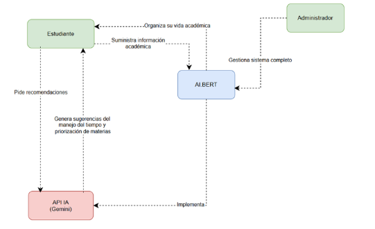
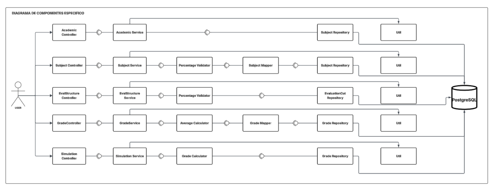
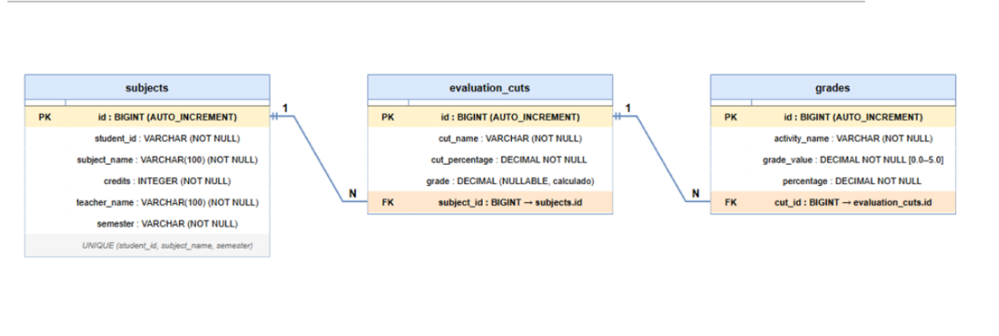

# IABert — Módulo 2: Gestión Académica

> Microservicio REST para la gestión académica de estudiantes: materias, cortes de evaluación, notas, promedios y simulación de nota objetivo. Componente del ecosistema de microservicios **IABert**.

---

## Tabla de Contenido

- [Descripción General](#descripción-general)
- [Equipo](#equipo)
- [Objetivos](#objetivos)
- [Planteamiento del Problema](#planteamiento-del-problema)
- [Requerimientos](#requerimientos)
- [Arquitectura](#arquitectura)
- [Stack Tecnológico](#stack-tecnológico)
- [Endpoints de la API](#endpoints-de-la-api)
- [Diagramas](#diagramas)
- [Gestión del Proyecto](#gestión-del-proyecto)
- [Pruebas y Calidad](#pruebas-y-calidad)
- [Instalación](#instalación)
- [Estructura del Proyecto](#estructura-del-proyecto)
- [Referencias](#referencias)

---

## Descripción General

### Resumen Ejecutivo

**IABert** es una plataforma académica construida como sistema de microservicios para apoyar la gestión universitaria. Este repositorio corresponde al **Módulo 2 — Gestión Académica**, desarrollado por el equipo `dark-code-knights`.

- **Problema a resolver:** Los estudiantes no tienen una herramienta centralizada para registrar y hacer seguimiento de sus notas por materia, visualizar sus promedios en tiempo real ni proyectar qué calificación necesitan en evaluaciones futuras para alcanzar su meta académica.
- **Solución propuesta:** API REST que expone operaciones CRUD de materias, cortes de evaluación y notas, con cálculo automático de promedios y un motor de simulación de nota objetivo.
- **Usuarios objetivo:** Estudiantes universitarios autenticados en la plataforma IABert.
- **Impacto esperado:** Reducir la incertidumbre académica dando al estudiante visibilidad total de su situación en cada materia y permitiéndole tomar decisiones informadas sobre sus evaluaciones pendientes.

### Alcance

#### Incluye
- CRUD completo de materias con estructura de cortes de evaluación (R06, R07)
- Registro, edición y eliminación de notas por actividad dentro de cada corte (R08, R09)
- Recálculo automático de promedios de corte y materia al modificar notas
- Dashboard académico con resumen general del estudiante (R05)
- Simulación de nota objetivo: calcula qué se necesita en los cortes pendientes para alcanzar una meta (R10)
- Formato de respuesta estándar unificado para toda la plataforma IABert

#### No Incluye
- Autenticación y generación de JWT (responsabilidad del Módulo 1 — auth-service)
- Interfaz gráfica de usuario (responsabilidad del equipo de Frontend)
- Comunicación activa con el Módulo 5 — stats-service (pendiente para Fase 8)
- Gestión de usuarios o roles (fuera del alcance de este módulo)

---

## Equipo

**Equipo:** `dark-code-knights`

| Integrante          | Rol                | Responsabilidades |
|---------------------|--------------------|-------------------|
| Jose Luis Lancheros | Backend Developer  | Creación y configuración del repositorio backend, estructura de carpetas, configuración CI/CD, implementación de requerimientos backend, dockerización completa del microservicio, despliegue en Azure                  |
| Natalia Mahecha     | Lider              | Requerimientos funcionales, matriz de trazabilidad, documentos del sprint, gestión del backlog en Jira, coordinación general del equipo                  |
| Andres Camilo Vivas | Backend Arquitectura | Diagramas de clases, componentes general y componentes específico, diagrama entidad-relación, implementación del set de pruebas, análisis de cobertura con JaCoCo y SonarQube                  |
| Carlos Uribe        | Frontend Developer | implementación de pantallas en Figma                  |

---

## Objetivos

### Objetivo General

Desarrollar un microservicio REST de gestión académica que permita a los estudiantes de la plataforma IABert registrar sus materias, llevar el control de sus notas y proyectar su rendimiento académico a lo largo del semestre.

### Objetivos Específicos

- Implementar un CRUD completo de materias con estructura de cortes de evaluación configurables por el estudiante.
- Garantizar la integridad de los datos académicos mediante reglas de negocio estrictas: rango de notas (0.0–5.0), porcentajes que sumen 100%, bloqueo de estructura cuando hay notas registradas.
- Calcular y actualizar automáticamente los promedios de cada corte y de la materia completa ante cualquier cambio en las notas.
- Exponer un dashboard académico que agregue el estado de todas las materias del estudiante en una sola consulta.
- Implementar un motor de simulación que indique al estudiante qué nota mínima requiere en los cortes pendientes para alcanzar su meta.
- Seguir estrictamente la arquitectura hexagonal (Puertos y Adaptadores) para garantizar mantenibilidad e independencia entre capas.

---

## Planteamiento del Problema

### Contexto

En el entorno universitario, los estudiantes gestionan su información académica de forma dispersa: anotan notas en cuadernos, hojas de cálculo o aplicaciones genéricas que no están integradas con la realidad de su plan de estudios. Esto genera confusión sobre su situación académica real.

### Problema

Los estudiantes carecen de una herramienta digital integrada que les permita:
1. Centralizar el registro de sus notas por materia y por corte evaluativo.
2. Ver en tiempo real cómo evoluciona su promedio ante cada calificación nueva.
3. Proyectar con precisión qué necesitan obtener en las evaluaciones que aún no han presentado.

### Dificultades Actuales

- Pérdida de información al no tener un registro persistente y estructurado de notas.
- Cálculos manuales propensos a errores al ponderarse notas por porcentaje de corte.
- Incertidumbre al no saber si todavía es posible aprobar una materia con las evaluaciones restantes.
- Falta de visión global del rendimiento académico en todas las materias del semestre.

### Solución Propuesta

Un microservicio dedicado a la gestión académica que persiste la información del estudiante en PostgreSQL, aplica las reglas de negocio en la capa de dominio y expone una API REST clara para ser consumida por el frontend de IABert o cualquier otro cliente autorizado.

---

## Requerimientos

### Requerimientos Funcionales

| ID  | Requerimiento               | Descripción                                                                                    | Endpoint principal                                       |
|-----|-----------------------------|------------------------------------------------------------------------------------------------|----------------------------------------------------------|
| R05 | Dashboard académico         | Resumen del estado académico del estudiante con todas sus materias y promedios                 | `GET /api/v1/academic/summary`                           |
| R06 | Gestión de materias         | CRUD completo de materias con nombre, créditos, docente y semestre                             | `POST /api/v1/subjects`                                  |
| R07 | Estructura de evaluación    | Configurar y modificar los cortes de evaluación de una materia (porcentajes que sumen 100%)    | `PUT /api/v1/subjects/{id}/evaluation-structure`         |
| R08 | Registro de notas           | Registrar calificaciones por actividad dentro de un corte, con cálculo automático de promedios | `POST /api/v1/subjects/{id}/cuts/{id}/grades`            |
| R09 | Edición de notas            | Editar y eliminar notas con recálculo automático de promedios de corte y materia               | `PUT/DELETE /api/v1/subjects/{id}/cuts/{id}/grades/{id}` |
| R10 | Simulación de nota objetivo | Calcular qué nota necesita el estudiante en los cortes pendientes para alcanzar su meta        | `POST /api/v1/subjects/{id}/simulate`                    |

### Requerimientos No Funcionales

| ID     | Requerimiento                 | Métrica / Descripción                                                                                    |
|--------|-------------------------------|----------------------------------------------------------------------------------------------------------|
| RNF-01 | Puerto del servicio           | Corre en el puerto `:8002`                                                                               |
| RNF-02 | Formato de respuesta estándar | Toda respuesta sigue el wrapper `ApiResponse<T>` unificado de la plataforma IABert                       |
| RNF-03 | Seguridad                     | Autenticación vía JWT emitido por auth-service (`:8001`). Deshabilitada en Sprint 1, se activa en Fase 7 |
| RNF-04 | Arquitectura                  | Estrictamente hexagonal: ninguna capa de infraestructura contamina el dominio                            |
| RNF-05 | Tiempo de respuesta           | Operaciones simples < 200 ms en condiciones normales de red local                                        |
| RNF-06 | Base de datos                 | PostgreSQL con base de datos propia `academic_db`, no compartida con otros módulos                       |
| RNF-07 | Escalabilidad                 | Diseño stateless; puede escalarse horizontalmente sin cambios de código                                  |
| RNF-08 | Documentación                 | API autodocumentada con SpringDoc OpenAPI accesible en `/swagger-ui.html`                                |

### Reglas de Negocio Críticas

- **Materias:** nombre mínimo 3 caracteres, créditos entre 1 y 10. No se permiten duplicados (mismo nombre + mismo semestre por estudiante).
- **Cortes de evaluación:** la suma de `cutPercentage` debe ser exactamente 100. La estructura **no se puede editar** si ya hay notas registradas.
- **Notas:** rango 0.0–5.0. La suma de porcentajes de actividades dentro de un corte no puede superar 100. Al editar o eliminar una nota, se recalculan los promedios automáticamente.
- **Simulación:** si la nota requerida supera 5.0, `isAchievable: false`. Solo se consideran los cortes sin nota registrada.

---

## Arquitectura

### Patrón: Hexagonal (Puertos y Adaptadores)

El servicio sigue estrictamente la arquitectura hexagonal. El **dominio** es el núcleo independiente; las capas externas se comunican con él únicamente a través de **puertos** (interfaces).

```
entrypoints → application → domain ← infrastructure
```

```
src/main/java/com/aibert/dosw/
│
├── entrypoints/                  # Capa de entrada HTTP
│   ├── rest/
│   │   ├── controller/           # @RestController — recibe requests y delega al use case
│   │   └── mapper/               # Convierte Request DTO → domain model
│   └── advice/                   # @RestControllerAdvice — manejo global de excepciones
│
├── application/                  # Capa de aplicación
│   ├── usecase/                  # Casos de uso — orquestan la lógica de negocio
│   ├── service/                  # Servicios transversales (AverageCalculator)
│   ├── dto/
│   │   ├── request/              # DTOs de entrada
│   │   └── response/             # DTOs de salida
│   └── mapper/                   # MapStruct — DTOs ↔ domain models
│
├── domain/                       # Núcleo de negocio — SIN dependencias externas
│   ├── model/                    # Subject, EvaluationCut, Grade, SimulationResult
│   ├── ports/
│   │   ├── in/                   # Interfaces de entrada (casos de uso)
│   │   └── out/                  # Interfaces de salida (repositorios)
│   └── exceptions/               # Excepciones de dominio propias
│
├── infrastructure/               # Capa de infraestructura
│   └── adapters/
│       ├── adapter/              # Implementaciones de puertos out
│       └── persistence/
│           ├── entity/           # @Entity JPA
│           ├── mapper/           # MapStruct: domain ↔ JPA entity
│           └── repository/       # Interfaces JpaRepository
│
└── config/                       # Configuración de Spring (Security)
```

### Principios de diseño aplicados

- **Inversión de dependencias:** el dominio define los puertos; la infraestructura los implementa.
- **Separación de responsabilidades:** ninguna lógica de negocio en controllers ni en entidades JPA.
- **Mapeo sin código manual:** MapStruct genera todos los mappers en tiempo de compilación.
- **Fallo rápido y explícito:** excepciones de dominio propias capturadas por el `GlobalExceptionHandler`.

---

## Stack Tecnológico

| Área          | Tecnología                  | Versión            | Uso                                      |
|---------------|-----------------------------|--------------------|------------------------------------------|
| Lenguaje      | Java                        | 21                 | Lenguaje principal                       |
| Framework     | Spring Boot                 | 3.4.3              | Base del microservicio                   |
| Persistencia  | Spring Data JPA + Hibernate | (incluido en Boot) | ORM y acceso a PostgreSQL                |
| Base de datos | PostgreSQL                  | 16                 | Almacenamiento relacional                |
| Seguridad     | Spring Security + jjwt      | 0.11.5             | JWT (activo en Fase 7)                   |
| Mapeo         | MapStruct                   | 1.5.5.Final        | Conversión entre capas sin código manual |
| Boilerplate   | Lombok                      | 1.18.32            | `@Builder`, `@Getter`, `@Data`, etc.     |
| Documentación | SpringDoc OpenAPI           | 2.8.5              | Swagger UI automático                    |
| Validación    | Spring Boot Validation      | (incluido en Boot) | Bean Validation con `@Valid`             |
| Contenedores  | Docker + Docker Compose     | —                  | Base de datos local en desarrollo        |

---

## Endpoints de la API

La documentación interactiva completa está disponible en **`http://localhost:8002/swagger-ui.html`** una vez levantado el servicio.

### Materias (R06)

| Método   | Ruta                           | Descripción                                  |
|----------|--------------------------------|----------------------------------------------|
| `POST`   | `/api/v1/subjects`             | Crear nueva materia con cortes de evaluación |
| `GET`    | `/api/v1/subjects`             | Listar todas las materias del estudiante     |
| `GET`    | `/api/v1/subjects/{subjectId}` | Obtener detalle de una materia               |
| `PUT`    | `/api/v1/subjects/{subjectId}` | Actualizar materia                           |
| `DELETE` | `/api/v1/subjects/{subjectId}` | Eliminar materia                             |

### Estructura de Evaluación (R07)

| Método | Ruta                                                | Descripción                                       |
|--------|-----------------------------------------------------|---------------------------------------------------|
| `PUT`  | `/api/v1/subjects/{subjectId}/evaluation-structure` | Configurar o reemplazar los cortes de una materia |
| `GET`  | `/api/v1/subjects/{subjectId}/evaluation-structure` | Consultar la estructura de cortes actual          |

### Notas (R08, R09)

| Método   | Ruta                                                         | Descripción                                  |
|----------|--------------------------------------------------------------|----------------------------------------------|
| `POST`   | `/api/v1/subjects/{subjectId}/cuts/{cutId}/grades`           | Registrar nota en un corte                   |
| `GET`    | `/api/v1/subjects/{subjectId}/cuts/{cutId}/grades`           | Listar notas de un corte                     |
| `PUT`    | `/api/v1/subjects/{subjectId}/cuts/{cutId}/grades/{gradeId}` | Editar una nota                              |
| `DELETE` | `/api/v1/subjects/{subjectId}/cuts/{cutId}/grades/{gradeId}` | Eliminar una nota                            |
| `GET`    | `/api/v1/subjects/{subjectId}/averages`                      | Consultar promedios de una materia por corte |

### Dashboard y Simulación (R05, R10)

| Método | Ruta                                    | Descripción                                |
|--------|-----------------------------------------|--------------------------------------------|
| `GET`  | `/api/v1/academic/summary`              | Dashboard académico general del estudiante |
| `POST` | `/api/v1/subjects/{subjectId}/simulate` | Simular nota objetivo en cortes pendientes |

### Formato de respuesta estándar

```json
// Éxito
{
  "success": true,
  "data": { ... },
  "message": "ok"
}

// Error
{
  "success": false,
  "error": "Mensaje descriptivo del error",
  "code": 422
}
```

---

## Diagramas

### Contexto del sistema

- El sistema interactúa con un sistema externos:  Api IA que en este caso vamos a usar gemini
  Además, se identifican dos actores principales: el estudiante, quien utiliza el sistema para gestionar su información académica y consultar sus resultados, y el administrador, encargado de supervisar el sistema y garantizar la integridad de los datos. Estas interacciones muestran cómo el sistema se integra con su entorno y quiénes lo utilizan directamente.


### Diagrama de Clases (Dominio)
- [Diagrama_de_clases link](https://viewer.diagrams.net/?tags=%7B%7D&lightbox=1&highlight=0000ff&edit=_blank&layers=1&nav=1&title=DiagramaClasesAIBERT.xml&dark=0#R%3Cmxfile%3E%3Cdiagram%20name%3D%22Academic%20Service%20-%20Diagrama%20de%20clases%22%20id%3D%22class-diagram%22%3E5V1bd%2BI4Ev41nJN56BzLN%2BCRGMKwu92dgcn2zhPHsRXwjsGMLwnsr1%2FJlo0sXzEC29NPwXJJCH1flapKZWcgabvj3NUP26%2BOCe2BKJjHgTQdiCIYSWP0B7ecopYRvsING9cyoybh3LCy%2FgdJz7g1sEzokbaoyXcc27cO6UbD2e%2Bh4afadNd1PtNi745tphoO%2BgZmGlaGbmdbf1imv41a0aSF841fobXZxl89jO%2Fs9FiaNHhb3XQ%2BqSZpNpA013H86NPuqEEbr156YZ4L7iYzc%2BHer9PB1k%2FQXSNh95TtSkbz%2FFP8y71Pa2fre3T15Pm66xNsJAE1vDv7%2BBrI8TXpCtC16wR7E5rkSneNuDO6ir7oQ7cD8kUzPKODY%2B19j9yDrg%2BP1LzI75lDZwfD2QtbeslVssCfZ4CAqqhRIxknliE0lMmlTuixSYY%2BLyD6QNYwfz1XWnYZM2tML%2BhWP%2BCPu%2BMG68pjsLMfDVv30BSePreWD1cH3cACn%2Bg2atv6OzteQdva7NFnA40MXQYAkLeoA00cTJ6i4dHHJySh2miST28u%2BrTBn1bB23%2BRymhoKNexbehmRfJanrC2uVD34cMvRfc30J%2FYdun9p9PCLBYIDmbpFyAzA6P7TQgDsoRJtPSYJghHvkx6zpeJoZtwZxlNCIMAXwW7ne6eHjw%2FMNG0FmYz8IZKJXbSDcCb9V3bZ1hc9y1nv%2FLdwPADFzbSfGf%2Fbm1Q51LlTr6ioYaOckCW0yAr4xF3kOc9xxj5YGYjVF24sTw0j1JQw9G9tmy2UG2zRzFteG7yi55zYmXtAjvU%2BybE8KLe8MGLnIWFORC1kDB%2F3cx8A6DwV%2B0IMv1w6JTrOzkcbMsI0Wm0mslOl3J9h8My1ze5vmY5NXf1WqgYySq3qxYWFn%2FHo8aqMRAlgDFcaKH%2FShzgVw9qugep%2B6mPlL9LlOCXgTRBjaR7I%2BByQpYKD1Thsb%2F5vUZtjp3IcM29GphFMcjTaRX5mw8EtX%2BhjS5PlsQj1yNbbeAYZIGoXA%2Ft66HX0L6GvkN9hSS%2BhkW2ozYVUxQ4wDe1ew3fNHTt6sNHXEHLJIh9OBjJBnApl8M1HHEwpJNew4UMaRzMk6i8nj3NCeEpm8pJ2xQmmAf890Ft1mv4tDgGz4np6zgzVAhPb4l2Ok2gBT4VHWS5QIX4dUfhFC8MmUzASOLOkOVm3meGLEk8H4bsNShBxf8hlmG%2FPNSjHMDTCcH6cLXy50ArVUT0w0cuvlKvwY18pbrQJlkZGtgmO%2B3laAGJgyZO7V6DFXlGdcFKUmT8vaIKrEQBXI%2FVytr1GSuSKoO%2F625s6mpglqTI4ugjSbgtoRfY%2FBwjJgEOgMykybgYR%2BTEf9VzsmQ9AZHEIOgnHMI8Zx5s4RBIInJh4iE42USBQUkGt9jC5q7ZZ5RC3eouRgBwiBEnHxtNt42OY5Q%2BO4iXf4IWWd9APH9sy5wilIjzaBA5iNxC0rXhMU%2Be3atEa8xh64pAMZ2dbu2zkLV4RDClpnTp6cAo93RASi0nczqg8jgdIEYYTb2I%2FfRCd1EBkhRiHu2%2FkJ8aRj%2FOfsPcSrIjxB%2FwXSsrE43%2FTd%2FBEinDhable5HEAv2uTcpeYhEf6sYWuhUDeXAHvXBZCkUgHbJ7twzpQZ57yjg3Nzj8wD8ATb3HpGQhuJyaTlBFOSTxAl0837AwEstNneDNhozcJgwkU%2FebUEGoUc0jjrhzIfQ%2FesyEbH6mLgOMIDFMOXd1w7c%2BLP9UQZIQ%2FH9HUy1kyKGARk1oIuZYDIYmSuwFcKQJCuVQDNdjnmRj0SLK%2BOeYtwRTF%2F4VWGhTqpJDe5KFNhR8IxR6cxwb6vsMQ%2FYmIleRvWlClLzKzkzmQ%2BROlAXyF5Yv3WdJWfIj8kiW8OB4FvL4Ty%2BOW8AXkvfQP6Jir3Tzu7U3k9revFur2D3KkYjyX3F3XhtKuW%2FBpbxogQLynhMg1Onbw68F94Se9SVGDPaAh2N5XH177j708GjAQ1hpVhDsfHP8ZxyZzhLBJjDIOSioTAQPpHQEz8W9Py5mqz6jsNgjYcvMOdO9PyBJte11iMz7rRehRWxPK4AicgHh%2B7L3IHwP%2FO%2FvS32%2FaUEXuNR3zY7TXhunaRAVKsc1Xi3AoHDIyc%2BOmjbrMw7Ie9J09H0oRscQQBO2YJgkwCHhPjt%2Beyk8K%2B4DFN%2Bclyh%2BxfnS24MgCzJ3n%2Bn3xfLty%2BTX1WktLacz7Z8%2Fhr%2BBL0TNoJl5MLoUJSdwDdKBTf9TCOJR46MQFGBsnY2z1%2B3ZufUJrekEP7eNBQ5wH7U8W%2Fg3TNnDFXwNj5b%2FH3zvcTwekes%2FwmtZlcn19Eg6hxen%2BAI%2FvxN1FQQpboj6qkMxbjh3Dq9SvV%2Bga6FVx4RKxmfbojWI8iuD3Ew0TbpcrrgQJ3E%2B0njkAR92RcunnyiB86PVZOQX3EAFRWI6KIqzbc%2B15QFDumgGl31bMt2ISaRXyTRkATADMe5StOSZgUKlSBa3uZ6Mr9YTlgd30xM5rSeKWq4nOaRO6Y6c1h35rEyX6E5WT9JZ%2BrtpSSHjVKYUGQiAreWoS16VyVYDQWKH4kffiIXW%2Ft3VsxRt8Wh7gWfkxVFuo50zr2AAqEyBsCoyaz3kcTYQvC0nRRpPrXUnjwXYXO%2FE1A94XF7Oi1SaceWVcf%2FHIYfPHQOgOuOOfsUZiDshwKUyF83%2F5WuPASDrj%2FYhDxe%2F742kIu0uGIg8cmxz1%2BytFWIOHG5sg8TxDYwQWv6eG6EQhLuYIBYALjYIAdBrGxQu%2F90skDhOPynFxQSRKKbfepAqrbqNOrDvr5FuUK8SvM1ItNBlGEqdUvQDLP%2FU%2FcLL%2FJLKBlwBoPrcWlHYXIfKTXH7y5iU0l7Bm%2BqqSKNzVZEjMOTPCLSb9pcN4VZ6BQu6WvtYgwxAUBX%2BbHDXYY5jnQq1a6Q7aZ6kTwXiUOWiRKepe9sko9Q866lQOU9Q91xASWU2K7Ka0W%2BjE5iplcvQOPASP%2BSqdOaleFJxe1%2FRTOWvlTuhSa3bzbBsdoCTDqzIAz6FxzdMGDYuP%2B0BCvu0lcCQjjrtaZCcdtdznMNYp2Lp5rycnxMiP42VoVeuA1YmwnN%2Bjsz7imZDK6OMUng%2BCjKowLT2eZjZTQMkjtK1CUOx1KSw4lUmSBbBVfKikJrP1SYr9zhY5rCjJs73XU6CQTN%2BZ857lSEnfrMBact1EcMhQ7uRWkyj7L6ZvKbo2kIHILHv6pCH6ZFuXOmgXEttFtj70BsxNV0QpEj1OS4yHJca1TTUqweaU2F3y5xH0SbD2lGJ7cxzFpnu7AMWtUmvMvlRAMRbkR4FRtpac1c1aB5XS9B2W%2Fu53E3q1b8dcDYRcnO%2Fs8jRtkhN2aIRqIkXSBsiUamyQ%2FVMjp8LYhvBq8g4g%2Bq41DCw8nEZIL94FFHq9dB5SiEqtKD81GuGW%2BYNe5pcERMw4rJaLp48GJgvz4dlU7sHLAMtsIx6G3LLLBtdxjJGXJEuYxkjz4FlE7Q9ThqybPKTOTbUS5074NjMsE86awjd7KdzSmddwm6urZebeTPo5m0iJ9I%2BhfA4HlU8GdAQv3o%2BKvUO5m5g%2BnroLKb5Ob1hzaQeE2NIqlwFYL2EHvWiZX77%2BEWQTe2eQXb5ozid8JMAYCsQyHVhfkcU2Ljvwg7ySGHoUJqZAkM1t%2Ftt8kkLbb2yds2ol%2FzLsZ9l86ZeG90BQ6%2B5K1wi0Qw7Kjl2b8vRzNZX5pNy4GIe7207gcSknOP%2FiVaYQGLkh%2BQ0pZ4dSUqv4t5sCTVPM4K82vVMa8jE2R2Z2I7duN1z1PWtBXJScalDM4woD%2FcOGDVzDR8FIQ3TozTk4x229HhvQX5QZt5xoZSnoceSdJX8UJGLrU4zn8ParVfLhi7HeQf%2BuxoL5l2ebdiKczlt%2FKrAi3HiXHX5ZjvGnxmgPN91%2FoQ%2FSL0xSODKgic0Aq%2BqXCQLHr1mrUSSSYliU%2BTmnCvZeoMctWY3Rw5duo7j00YUP5Pw1TEhlvg%2F%3C%2Fdiagram%3E%3C%2Fmxfile%3E)
- El diagrama de clases del academic-service sigue una arquitectura hexagonal (Puertos y Adaptadores), dividida en cuatro capas: Entrypoints, Aplicación, Dominio e Infraestructura. Esta estructura permite separar responsabilidades y mantener la lógica de negocio independiente de tecnologías externas
-  Capa de Entrypoints (Controladores REST) ->
   Responsabilidad:
   Recibir peticiones HTTP, validar datos y delegar la lógica a los casos de uso.
-  Capa de Aplicación (Casos de Uso) ->
   Responsabilidad:
   Implementar la lógica de negocio mediante casos de uso.
-  Capa de Dominio ->
   Responsabilidad:
   Contener entidades, reglas de negocio y puertos del sistema
-  Capa de Infraestructura (Adaptadores) ->
   Responsabilidad:
   Implementar los puertos del dominio usando JPA y PostgreSQL

### Diagrama de Componentes especifico

- El diagrama específico muestra la organización interna del academic-service. Cada flujo de requerimiento sigue la misma arquitectura en capas: Controller → Service → Validator/Calculator → Repository, con apoyo de Mappers (MapStruct) para la conversión entre entidades y DTOs. La tabla a continuación describe cada componente y su responsabilidad.

### Entidad-Relación

- El modelo de datos del Módulo 2 está compuesto por tres entidades principales: subjects (materias), evaluation_cuts (cortes evaluativos) y grades (notas). La entidad subjects actúa como núcleo del módulo, ya que concentra la información de cada materia y se relaciona con los cortes y las notas mediante claves foráneas.


---

## Gestión del Proyecto

### Metodología

**Scrum** — sprints de duración fija con entregas incrementales y revisión al final de cada fase.

### Sprints

| Sprint            | Rama                                | Objetivo                                                                                            | Estado       |
|-------------------|-------------------------------------|-----------------------------------------------------------------------------------------------------|--------------|
| Sprint 1 — Fase 0 | `feature/project-setup`             | Bootstrap del proyecto: estructura base, `ApiResponse<T>`, `GlobalExceptionHandler`, Docker Compose | ✅ Completado |
| Sprint 1 — Fase 1 | `feature/subject-crud`              | CRUD completo de materias con cortes de evaluación (R06)                                            | ✅ Completado |
| Sprint 1 — Fase 2 | `feature/evaluation-structure`      | Configuración de estructura de evaluación con bloqueo por notas (R07)                               | ✅ Completado |
| Sprint 1 — Fase 3 | `feature/grade-registration`        | Registro de notas con cálculo de promedio de corte (R08)                                            | ✅ Completado |
| Sprint 1 — Fase 4 | `feature/grade-management`          | Edición/eliminación de notas con recálculo automático, consulta de promedios (R09)                  | ✅ Completado |
| Sprint 1 — Fase 5 | `feature/academic-dashboard`        | Dashboard académico agregado por estudiante (R05)                                                   | ✅ Completado |
| Sprint 1 — Fase 6 | `feature/grade-simulation`          | Simulación de nota objetivo en cortes pendientes (R10)                                              | ✅ Completado |
| Sprint 2 — Fase 7 | `feature/jwt-security`              | Activar Spring Security con JWT del auth-service                                                    | 🔜 Pendiente |
| Sprint 2 — Fase 8 | `feature/inter-service-integration` | Integración con stats-service vía OpenFeign                                                         | 🔜 Pendiente |

### Riesgos

| Riesgo                                          | Impacto | Probabilidad | Mitigación                                                                               |
|-------------------------------------------------|---------|--------------|------------------------------------------------------------------------------------------|
| Retraso en entrega de JWT por M1 (auth-service) | Alto    | Media        | Desarrollo con header temporal `X-Student-Id`; Fase 7 solo cambia el punto de extracción |
| Inconsistencia de datos entre microservicios    | Medio   | Baja         | Base de datos propia e independiente por módulo                                          |
| Cambios en el modelo de datos del Gateway       | Medio   | Media        | Contratos de API versionados en `/api/v1/`                                               |
| Deuda técnica por falta de tests unitarios      | Alto    | Media        | Priorizar tests de use cases en Sprint 2                                                 |

---

## Pruebas y Calidad

### Estrategia de pruebas

- **Pruebas manuales de integración:** cada fase fue validada end-to-end en Swagger UI antes de hacer merge a `develop`.
- **Pruebas unitarias:** pendientes.
- **Pruebas de contrato de API:** verificación de formato `ApiResponse<T>` en todos los endpoints.

### Flujos de prueba validados por fase

| Fase                              | Casos probados                                                   | Resultado       |
|-----------------------------------|------------------------------------------------------------------|-----------------|
| Fase 1 — Materias                 | 13 casos (CRUD, duplicados, porcentajes inválidos)               | ✅ Todos pasaron |
| Fase 2 — Estructura de evaluación | 11 casos (bloqueo por notas, validaciones)                       | ✅ Todos pasaron |
| Fase 3 — Registro de notas        | 15 casos (rango, capacidad del corte, promedios)                 | ✅ Todos pasaron |
| Fase 4 — Edición de notas         | 16 casos (edición, eliminación, recálculo)                       | ✅ Todos pasaron |
| Fase 5 — Dashboard académico      | 4 casos (sin materias, con materias, GPA, aislamiento)           | ✅ Todos pasaron |
| Fase 6 — Simulación               | 8 casos (alcanzable, inalcanzable, ya asegurada, sin pendientes) | ✅ Todos pasaron |

### Calidad de código

- Arquitectura hexagonal verificada: cero dependencias de infraestructura en el dominio.
- Manejo exhaustivo de excepciones: 9 tipos de excepciones de dominio cubiertas en el `GlobalExceptionHandler`.
- Sin mapeo manual entre capas: 100% MapStruct.

---

## Instalación

### Requisitos previos

- Docker y Docker Compose

### 1. Clonar el repositorio

```bash
git clone https://github.com/dark-code-knights/academic-service.git
cd academic-service
```

### 2. Configurar variables de entorno

El archivo `.env` incluido en el repositorio ya tiene los valores por defecto para desarrollo local:

```env
DB_NAME=academic
DB_USER=academic_user
DB_PASSWORD=academic_pass
```

Modifica los valores si tu entorno lo requiere.

### 3. Levantar el stack completo con Docker Compose

```bash
docker compose up --build
```

Este comando:
- Construye la imagen del microservicio desde el `Dockerfile`
- Levanta **PostgreSQL 16** en el puerto `5435`
- Levanta el **backend** en el puerto `8083`
- Espera a que la base de datos esté lista antes de iniciar el backend (`healthcheck`)

Para ejecutarlo en segundo plano:

```bash
docker compose up --build -d
```

Para detener y eliminar los contenedores:

```bash
docker compose down
```

### 4. Explorar la API con Swagger

Una vez levantado, abre en el navegador:

**`http://localhost:8083/swagger-ui.html`**

### Desarrollo local sin Docker

Si preferís ejecutar el backend directamente con Maven (requiere PostgreSQL corriendo en `localhost:5432`):

```bash
./mvnw spring-boot:run
```

El servicio queda disponible en **`http://localhost:8080`**.

---

## Estructura del Proyecto

```
academic-service/
│
├── src/main/java/com/aibert/dosw/
│   ├── AcademicServiceApplication.java
│   │
│   ├── domain/
│   │   ├── model/              # Subject, EvaluationCut, Grade, SimulationResult
│   │   ├── ports/
│   │   │   ├── in/             # 8 interfaces de casos de uso
│   │   │   └── out/            # SubjectRepositoryPort, GradeRepositoryPort
│   │   └── exceptions/         # 8 excepciones de dominio propias
│   │
│   ├── application/
│   │   ├── usecase/            # 9 implementaciones de casos de uso
│   │   ├── service/            # AverageCalculator
│   │   ├── dto/
│   │   │   ├── request/        # 6 DTOs de entrada
│   │   │   └── response/       # 7 DTOs de salida
│   │   └── mapper/             # SubjectMapper, GradeMapper (MapStruct)
│   │
│   ├── infrastructure/
│   │   └── adapters/
│   │       ├── adapter/        # SubjectRepositoryAdapter, GradeRepositoryAdapter
│   │       └── persistence/
│   │           ├── entity/     # SubjectEntity, EvaluationCutEntity, GradeEntity
│   │           ├── mapper/     # SubjectPersistenceMapper, GradePersistenceMapper
│   │           └── repository/ # SubjectJpaRepository, EvaluationCutJpaRepository, GradeJpaRepository
│   │
│   ├── entrypoints/
│   │   ├── ApiResponse.java
│   │   ├── advice/             # GlobalExceptionHandler
│   │   └── rest/
│   │       ├── controller/     # SubjectController, EvaluationStructureController,
│   │       │                   # GradeController, AcademicController, SimulationController
│   │       └── mapper/         # SubjectEntrypointMapper
│   │
│   └── config/
│       └── SecurityConfig.java
│
├── src/main/resources/
│   └── application.yml         # Puerto 8002, datasource, JPA, Swagger paths
│
├── docker-compose.yml          # PostgreSQL 16 para desarrollo local
├── .env                        # Variables de entorno (DB_USER, DB_PASSWORD)
├── pom.xml
└── README.md
```

---

## Referencias

- [Spring Boot 3.4 Reference Documentation](https://docs.spring.io/spring-boot/docs/3.4.3/reference/html/)
- [Spring Data JPA](https://docs.spring.io/spring-data/jpa/docs/current/reference/html/)
- [MapStruct 1.5 Reference Guide](https://mapstruct.org/documentation/stable/reference/html/)
- [SpringDoc OpenAPI](https://springdoc.org/)
- [PostgreSQL 16 Documentation](https://www.postgresql.org/docs/16/)
- [jjwt — Java JWT Library](https://github.com/jwtk/jjwt)
- [Arquitectura Hexagonal — Alistair Cockburn](https://alistair.cockburn.us/hexagonal-architecture/)
- [Lombok Project](https://projectlombok.org/)

---

> **Módulo 2 — Gestión Académica** · Equipo `dark-code-knights` · IABert Platform · 2026
